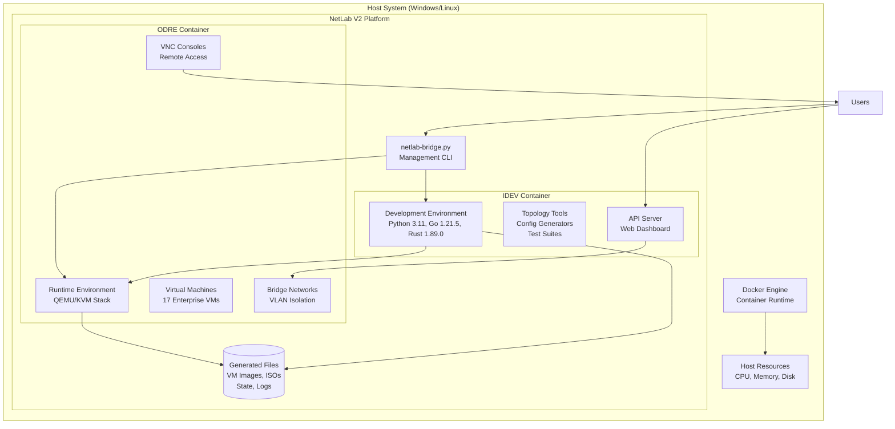
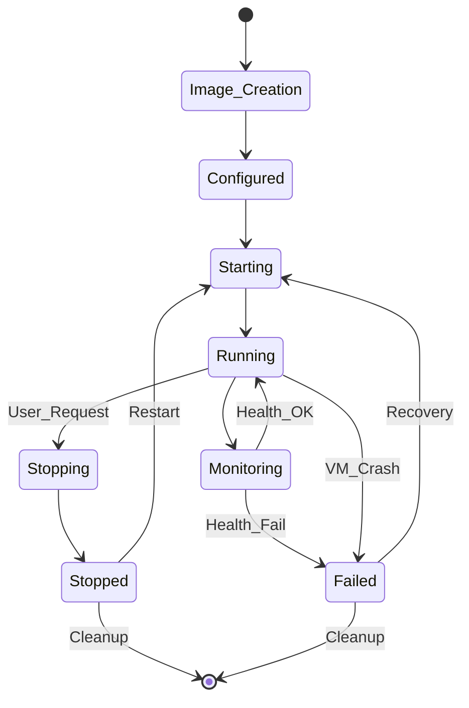
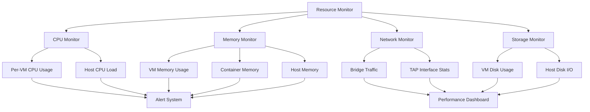
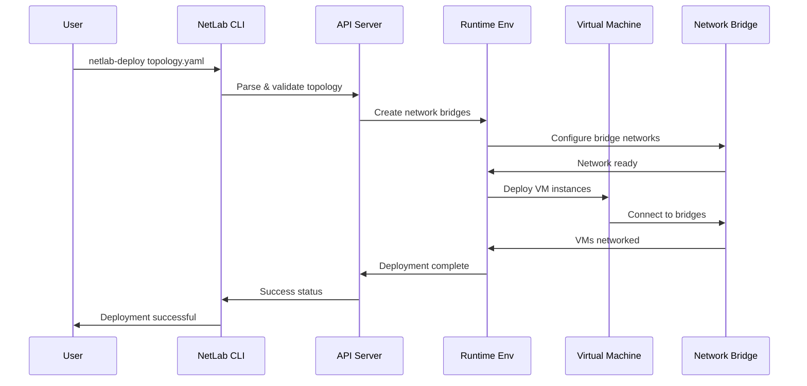
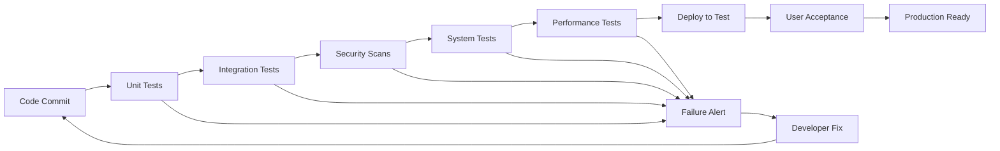
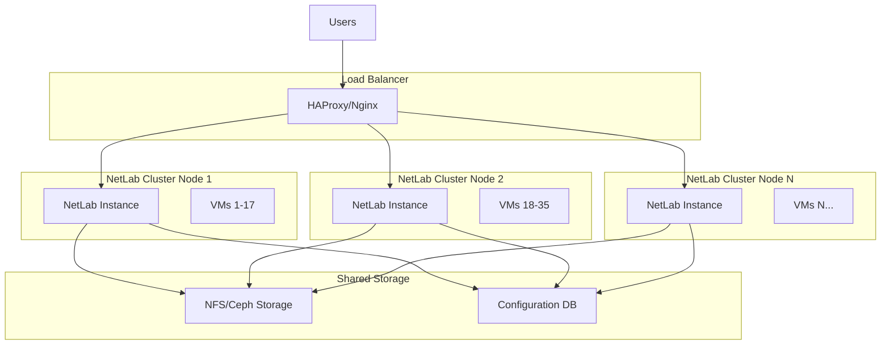
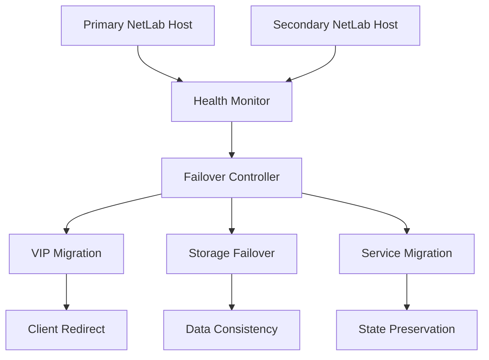

# NetLab V2 - System Design & Architecture

[](system-design.md)
[](system-design.md)
[](system-design.md)

> **Deep-dive into NetLab V2's enterprise-grade architecture, design patterns, and implementation strategies**

## 🏗️ Architecture Overview

NetLab V2 follows a **dual-environment, containerized architecture** designed for maximum isolation, scalability, and security. The system separates development and runtime concerns into distinct containerized environments while providing seamless integration and management.

### **Core Design Principles**

1. **Complete Isolation**: Zero contamination of host system
2. **Security First**: Multi-layer security with least privilege
3. **Scalable Design**: Resource-efficient with horizontal scaling capabilities
4. **Enterprise Ready**: Production-grade reliability and monitoring
5. **Developer Friendly**: Simple APIs and intuitive interfaces
6. **Platform Agnostic**: Windows/Linux compatibility with consistent behavior

### **High-Level System Architecture**



## 🎯 Design Patterns & Methodologies

### **1. Container-First Architecture**

**Pattern**: Dual-environment containerization
```yaml
Design Rationale:
  - Complete host system isolation
  - Reproducible environment deployment
  - Resource constraint enforcement
  - Easy cleanup and restoration
  
Implementation:
  IDEV (Isolated Development Environment):
    Purpose: Development tools, testing, API services
    Base Image: Ubuntu 22.04 LTS
    Key Components:
      - Multi-language development stack
      - Network topology tools
      - Web dashboard and APIs
      - Testing and validation suites
    
  ODRE (Open Devices Runtime Environment):
    Purpose: VM execution and network management
    Base Image: Ubuntu 22.04 LTS
    Key Components:
      - QEMU/KVM virtualization
      - Bridge networking stack
      - VNC console services
      - VM lifecycle management
```

### **2. Service-Oriented Design**

**Pattern**: Microservices within containers
```python
# Service separation within containers
Services:
  API_Server:
    Purpose: REST API endpoints
    Port: 9000
    Components:
      - VM management endpoints
      - Network topology API
      - Testing service API
      - Configuration management
  
  VNC_Service:
    Purpose: Console access
    Ports: 5920-5950 (per VM)
    Components:
      - Per-VM console isolation
      - Authentication layer
      - Session management
  
  Network_Manager:
    Purpose: Network orchestration
    Components:
      - Bridge creation/management
      - VLAN configuration
      - TAP interface management
      - Inter-network routing
```

### **3. Event-Driven Architecture**

**Pattern**: Asynchronous event handling
```javascript
Event Flow:
  User_Action → API_Request → Service_Handler → VM_Operation → Status_Update → UI_Refresh

Event Types:
  - VM Lifecycle: start, stop, restart, error
  - Network Events: connect, disconnect, bridge_up/down
  - Test Events: start, progress, complete, fail
  - System Events: deployment, cleanup, resource_alerts
```

## 🌐 Network Architecture Design

### **Software-Defined Networking Stack**

```bash
# Network hierarchy
Host Network Interface (eth0)
    ↓
Docker Bridge Networks
    ↓ 
NetLab Bridge Networks (isolated)
    ├── netlab-dmz (192.168.10.0/24)
    ├── netlab-corp (192.168.20.0/24)
    └── netlab-sec (192.168.40.0/24)
        ↓
TAP Interfaces (per VM)
    ├── tap0 → edge-firewall
    ├── tap1 → web-server
    └── tap2 → core-router
        ↓
VM Network Interfaces (eth0 in each VM)
```

### **VLAN Segmentation Design**

```yaml
Network_Design:
  DMZ_Network:
    CIDR: "192.168.10.0/24"
    Gateway: "192.168.10.1"
    Purpose: "External-facing services"
    Security_Zone: "Untrusted"
    Devices:
      - Edge Firewall (192.168.10.10)
      - Web Server (192.168.10.20)
      - Load Balancer (192.168.10.30)
  
  Corporate_Network:
    CIDR: "192.168.20.0/24"
    Gateway: "192.168.20.1"
    Purpose: "Internal corporate services"
    Security_Zone: "Trusted"
    Devices:
      - Core Router (192.168.20.2)
      - Database Server (192.168.20.10)
      - File Server (192.168.20.20)
  
  Security_Network:
    CIDR: "192.168.40.0/24"
    Gateway: "192.168.40.1"
    Purpose: "Security monitoring and management"
    Security_Zone: "Management"
    Devices:
      - SIEM Server (192.168.40.10)
      - IDS/IPS (192.168.40.11)
      - SOC Workstation (192.168.40.20)
```

### **Bridge Network Implementation**

```bash
# Bridge creation and configuration
Implementation Details:
  1. Bridge Creation:
     sudo ip link add name netlab-dmz type bridge
     sudo ip addr add 192.168.10.1/24 dev netlab-dmz
     sudo ip link set netlab-dmz up
  
  2. TAP Interface Creation:
     sudo ip tuntap add tap0 mode tap user $(whoami)
     sudo ip link set tap0 master netlab-dmz
     sudo ip link set tap0 up
  
  3. VM Network Attachment:
     qemu-system-x86_64 \
       -netdev tap,id=net0,ifname=tap0,script=no,downscript=no \
       -device virtio-net-pci,netdev=net0,mac=52:54:00:10:00:10
```

## 💻 Virtual Machine Architecture

### **VM Deployment Strategy**

```yaml
VM_Architecture:
  Base_Image:
    OS: Alpine Linux 3.19
    Size: 4GB (sparse allocation)
    Format: QCOW2 with compression
    Features:
      - Minimal footprint (< 200MB installed)
      - Fast boot time (< 30 seconds)
      - Security hardened by default
      - Container-friendly init system
  
  VM_Configuration:
    Standard_Allocation:
      CPU: 1 vCPU per VM (shared)
      Memory: 512MB - 2GB (per VM type)
      Disk: 4GB - 8GB (sparse)
      Network: Single virtio-net interface
    
    Enterprise_Allocation:
      Total_VMs: 17 concurrent
      Total_Memory: ~16GB allocated, ~8GB actual
      Total_Disk: 95GB allocated, ~60GB actual
      Total_CPU: 8-14 cores shared
```

### **VM Types & Specialization**

```python
VM_Specializations = {
    "firewall": {
        "memory": "512MB",
        "packages": ["iptables", "nftables", "tcpdump"],
        "services": ["iptables", "sshd"],
        "config": {
            "ip_forward": True,
            "firewall_rules": "default-deny",
            "logging": "enabled"
        }
    },
    "server": {
        "memory": "1024MB", 
        "packages": ["nginx", "python3", "sqlite"],
        "services": ["nginx", "sshd"],
        "config": {
            "web_server": True,
            "ssl_enabled": True,
            "monitoring": "enabled"
        }
    },
    "router": {
        "memory": "512MB",
        "packages": ["quagga", "bird", "tcpdump"],
        "services": ["bgpd", "ospfd", "sshd"],
        "config": {
            "routing": True,
            "bgp_enabled": True,
            "ospf_enabled": True
        }
    },
    "security": {
        "memory": "2048MB",
        "packages": ["suricata", "elasticsearch", "logstash"],
        "services": ["suricata", "elasticsearch"],
        "config": {
            "ids_enabled": True,
            "siem_integration": True,
            "log_retention": "30d"
        }
    }
}
```

### **VM Lifecycle Management**



## 🔒 Security Architecture

### **Multi-Layer Security Model**

```yaml
Security_Layers:
  Layer_1_Host:
    - Container isolation via Docker
    - Resource limits and quotas
    - Non-root container execution
    - Filesystem permission controls
    
  Layer_2_Network:
    - Bridge network isolation
    - VLAN segmentation
    - TAP interface isolation  
    - Inter-VLAN routing controls
    
  Layer_3_VM:
    - Hardware virtualization (KVM)
    - VM-to-VM isolation
    - Guest OS hardening
    - Console access controls
    
  Layer_4_Application:
    - API authentication (configurable)
    - VNC password protection
    - Web interface access controls
    - Audit logging
```

### **Security Boundaries**

```bash
Security Boundaries:
┌─ Host System ────────────────────────────────────────┐
│  ┌─ Docker Container Isolation ─────────────────────┐ │
│  │  ┌─ Network Bridge Isolation ─────────────────┐ │ │
│  │  │  ┌─ VM Hardware Isolation ──────────────┐ │ │ │
│  │  │  │  ┌─ Guest OS Security ──────────┐ │ │ │ │
│  │  │  │  │  Applications & Services   │ │ │ │ │
│  │  │  │  └────────────────────────────┘ │ │ │ │
│  │  │  │  VM Guest Operating System     │ │ │ │
│  │  │  └─────────────────────────────────┘ │ │ │
│  │  │  QEMU/KVM Hypervisor               │ │ │
│  │  └────────────────────────────────────────┘ │ │
│  │  Container Runtime Environment             │ │
│  └─────────────────────────────────────────────────┘ │
│  Host Operating System                              │
└──────────────────────────────────────────────────────┘
```

### **Attack Surface Minimization**

```python
Attack_Surface_Reduction = {
    "Container_Level": [
        "Minimal base images (Ubuntu 22.04 minimal)",
        "No unnecessary services running",
        "Read-only filesystem where possible",
        "Capability dropping (--cap-drop)",
        "User namespace isolation"
    ],
    "Network_Level": [
        "Default-deny firewall rules",
        "Bridge isolation (no inter-bridge routing)",
        "Limited port exposure to host",
        "TAP interface MAC address isolation"
    ],
    "VM_Level": [
        "Alpine Linux minimal installation",
        "Disabled unused kernel modules",
        "SSH key-only authentication",
        "Hardened kernel parameters"
    ]
}
```

## 📊 Resource Management Design

### **Resource Allocation Strategy**

```yaml
Resource_Management:
  Philosophy: "Conservative allocation with burst capability"
  
  Memory_Management:
    Strategy: "Overcommit with intelligent ballooning"
    Base_Allocation: "Physical memory / 2"
    Overcommit_Ratio: "1.5:1"
    Monitoring:
      - Per-VM memory usage tracking
      - Host memory pressure detection
      - Automatic VM memory ballooning
      - OOM prevention mechanisms
  
  CPU_Management:
    Strategy: "Shared CPU with priority queuing"
    VM_CPU_Shares:
      - Firewall/Router: High priority (1024 shares)
      - Servers: Medium priority (512 shares) 
      - Monitoring: Low priority (256 shares)
    CPU_Limits:
      - Maximum 80% host CPU utilization
      - Per-VM CPU quotas via cgroups
      - CPU steal time monitoring
  
  Storage_Management:
    Strategy: "Sparse allocation with thin provisioning"
    Disk_Format: QCOW2 with compression
    Allocation_Ratio: "3:1 (allocated vs actual)"
    Features:
      - Copy-on-write for space efficiency
      - Snapshot support for quick recovery
      - Automatic disk expansion
      - Storage quota enforcement
```

### **Performance Optimization Strategies**

```python
Performance_Optimizations = {
    "VM_Performance": {
        "KVM": "Hardware acceleration enabled",
        "CPU": "Host CPU passthrough where possible",
        "Memory": "Balloon driver for dynamic allocation",
        "Network": "virtio-net for near-native performance",
        "Storage": "virtio-scsi with AIO=native"
    },
    "Container_Performance": {
        "Networking": "Host networking for ODRE container",
        "Storage": "Direct volume mounts for VM storage",
        "CPU": "CPU affinity for container processes",
        "Memory": "Shared memory for inter-container communication"
    },
    "Network_Performance": {
        "Bridges": "Native Linux bridges (no OVS overhead)",
        "TAP_Interfaces": "Multi-queue TAP for parallel processing",
        "Packet_Processing": "Kernel bypass where applicable",
        "Buffer_Tuning": "Optimized network buffer sizes"
    }
}
```

### **Resource Monitoring Architecture**



## 🔄 Data Flow Architecture

### **Request Processing Pipeline**



### **Data Persistence Strategy**

```yaml
Data_Persistence:
  Configuration_Data:
    Location: "Git repository"
    Format: "YAML topology files"
    Versioning: "Git version control"
    Backup: "Repository clones"
  
  Runtime_Data:
    Location: ".generated/ directory"
    Components:
      - VM disk images (QCOW2)
      - Configuration ISOs
      - State files (JSON)
      - Log files (rotating)
    Lifecycle: "Temporary, cleaned on reset"
    Backup: "Optional, user-controlled"
  
  State_Management:
    VM_State: "QEMU savestate files"
    Network_State: "Bridge configuration cache"
    Application_State: "SQLite database"
    Session_State: "In-memory with persistence option"
```

### **Configuration Management**

```python
Configuration_Hierarchy = {
    "System_Level": {
        "file": "netlab.conf",
        "scope": "Global system settings",
        "examples": [
            "default_memory_limit",
            "maximum_vms",
            "network_ranges", 
            "security_policies"
        ]
    },
    "Topology_Level": {
        "file": "topology.yaml", 
        "scope": "Per-deployment configuration",
        "examples": [
            "vm_definitions",
            "network_topology",
            "resource_constraints",
            "deployment_options"
        ]
    },
    "Runtime_Level": {
        "file": "runtime.json",
        "scope": "Active deployment state",
        "examples": [
            "vm_pids",
            "bridge_interfaces", 
            "port_allocations",
            "resource_usage"
        ]
    }
}
```

## 🧪 Testing Architecture

### **Multi-Layer Testing Strategy**

```yaml
Testing_Architecture:
  Unit_Tests:
    Scope: "Individual component testing"
    Framework: "pytest (Python), go test (Go)"
    Coverage: ">90% code coverage"
    Components:
      - Configuration parsing
      - Network utilities
      - VM management functions
      - API endpoint logic
  
  Integration_Tests:
    Scope: "Component interaction testing"
    Framework: "Custom test harness"
    Components:
      - Container deployment
      - Network bridge creation
      - VM lifecycle management
      - End-to-end API workflows
  
  System_Tests:
    Scope: "Full system validation"
    Framework: "Automated test suites"
    Tests:
      - Complete topology deployment
      - Network connectivity validation
      - Performance benchmarking
      - Security configuration verification
  
  Load_Tests:
    Scope: "Scalability and performance"
    Framework: "Custom load generators"
    Scenarios:
      - Maximum VM deployment
      - Concurrent user access
      - Network throughput testing
      - Resource exhaustion handling
```

### **Continuous Validation Framework**



## 🔧 Operational Design

### **Monitoring & Observability**

```python
Observability_Stack = {
    "Metrics_Collection": {
        "System_Metrics": [
            "CPU usage per VM/container",
            "Memory utilization and pressure",
            "Network traffic and latency", 
            "Disk I/O and space usage"
        ],
        "Application_Metrics": [
            "API response times",
            "VM deployment success rates",
            "Network test results",
            "User session statistics"
        ]
    },
    "Logging_Strategy": {
        "Structured_Logs": "JSON format with correlation IDs",
        "Log_Levels": ["DEBUG", "INFO", "WARN", "ERROR", "FATAL"],
        "Rotation": "Size-based with compression",
        "Retention": "30 days default, configurable"
    },
    "Alerting_Rules": {
        "Resource_Exhaustion": "Memory >90%, Disk >95%",
        "Service_Failures": "VM crash, Bridge down, API errors",
        "Performance_Degradation": "Latency >100ms, Success rate <95%",
        "Security_Events": "Unauthorized access, Config changes"
    }
}
```

### **Deployment Automation**

```yaml
Deployment_Pipeline:
  Development:
    - Local development environment
    - Unit test execution
    - Code quality checks
    - Security scanning
  
  Staging:
    - Full system deployment
    - Integration testing
    - Performance validation
    - User acceptance testing
  
  Production:
    - Blue/green deployment
    - Health checks
    - Rollback capability
    - Monitoring activation
  
  Rollback_Strategy:
    Triggers:
      - Health check failures
      - Performance degradation  
      - User-reported issues
      - Security incidents
    Process:
      - Automatic traffic switching
      - State preservation
      - Incident logging
      - Team notifications
```

## 📈 Scalability Design

### **Horizontal Scaling Architecture**



### **Performance Scaling Strategies**

```python
Scaling_Strategies = {
    "Vertical_Scaling": {
        "CPU": "Increase host CPU cores",
        "Memory": "Add more RAM to host",
        "Storage": "Faster SSD storage",
        "Network": "Higher bandwidth interfaces",
        "Limits": "Single host resource limits"
    },
    "Horizontal_Scaling": {
        "Multi_Host": "Deploy across multiple machines",
        "Load_Distribution": "VM placement optimization",
        "Network_Clustering": "Distributed bridge networks",
        "State_Sharing": "Shared storage for VM images",
        "Coordination": "Cluster management layer"
    },
    "Resource_Optimization": {
        "VM_Packing": "Intelligent VM-to-host assignment",
        "Memory_Ballooning": "Dynamic memory allocation",
        "CPU_Pinning": "Optimal CPU core assignment",
        "Network_Queues": "Multi-queue network processing",
        "Storage_Tiering": "SSD cache with HDD storage"
    }
}
```

## 🛡️ Disaster Recovery Design

### **Backup & Recovery Strategy**

```yaml
Disaster_Recovery:
  Backup_Strategy:
    Configuration_Backup:
      Frequency: "Real-time (Git commits)"
      Location: "Multiple Git repositories"
      Retention: "Unlimited (version history)"
      
    State_Backup:
      Frequency: "Scheduled snapshots"
      Components:
        - VM disk images
        - Network configurations
        - Runtime state files
      Location: "External storage"
      Retention: "30 days with weekly/monthly archives"
  
  Recovery_Procedures:
    Configuration_Recovery:
      Method: "Git clone/pull operations"
      RTO: "< 5 minutes"
      RPO: "Last commit"
      
    Complete_System_Recovery:
      Method: "Automated restoration scripts"
      RTO: "< 30 minutes" 
      RPO: "Last snapshot"
      
    Partial_Recovery:
      Method: "Selective VM/network restoration"
      RTO: "< 10 minutes"
      RPO: "Last snapshot"
```

### **High Availability Considerations**



---

## 🚀 Future Architecture Enhancements

### **Planned Improvements**

```yaml
Roadmap_Architecture:
  Cloud_Native:
    - Kubernetes deployment support
    - Cloud provider integrations (AWS, Azure, GCP)
    - Auto-scaling based on demand
    - Serverless function integrations
  
  Advanced_Networking:
    - SDN integration (OpenFlow, P4)
    - Network function virtualization (NFV)
    - Intent-based networking
    - 5G network slice simulation
  
  AI_ML_Integration:
    - Intelligent resource allocation
    - Anomaly detection and response
    - Automated topology optimization
    - Predictive scaling
  
  Security_Enhancements:
    - Zero-trust networking model
    - Hardware security module integration
    - Advanced threat detection
    - Compliance automation (SOC2, ISO27001)
```

### **Extensibility Framework**

```python
Extension_Points = {
    "VM_Plugins": {
        "interface": "VMPlugin abstract class",
        "capabilities": ["custom OS support", "specialized configurations"],
        "examples": ["Windows VMs", "IoT simulators", "Container runtimes"]
    },
    "Network_Plugins": {
        "interface": "NetworkPlugin abstract class", 
        "capabilities": ["custom protocols", "specialized topologies"],
        "examples": ["MPLS networks", "Satellite links", "5G slices"]
    },
    "Monitoring_Plugins": {
        "interface": "MonitorPlugin abstract class",
        "capabilities": ["custom metrics", "specialized dashboards"],
        "examples": ["APM tools", "Security dashboards", "Custom KPIs"]
    },
    "Testing_Plugins": {
        "interface": "TestPlugin abstract class",
        "capabilities": ["specialized tests", "custom validators"],
        "examples": ["Security scanners", "Performance analyzers", "Compliance checkers"]
    }
}
```

---

## 📚 Architecture Documentation

### **Design Decision Records (DDRs)**

1. **[DDR-001] Container Architecture Choice**
   - **Decision**: Use dual-container (IDEV/ODRE) architecture
   - **Rationale**: Complete isolation with specialized environments
   - **Alternatives Considered**: Single container, VM-based, native installation

2. **[DDR-002] Bridge Networking vs OpenVSwitch**
   - **Decision**: Linux bridge networking with VLAN support
   - **Rationale**: Simplicity, performance, and reliability
   - **Alternatives Considered**: OpenVSwitch, Docker networks, host networking

3. **[DDR-003] Alpine Linux for VMs**
   - **Decision**: Alpine Linux as default VM operating system
   - **Rationale**: Minimal footprint, fast boot, security focus
   - **Alternatives Considered**: Ubuntu Server, CentOS Stream, Debian

### **Performance Benchmarks**

```yaml
Benchmark_Results:
  VM_Deployment:
    Single_VM: "< 2 minutes"
    Enterprise_Lab_17_VMs: "< 10 minutes"
    Maximum_Capacity: "50+ VMs (hardware dependent)"
  
  Network_Performance:
    Inter_VM_Latency: "< 1ms"
    Bridge_Throughput: "1Gbps+ per VM"
    Network_Convergence: "< 30 seconds"
  
  Resource_Efficiency:
    Container_Overhead: "< 5% CPU, < 2GB RAM"
    VM_Memory_Efficiency: "70% actual usage vs allocated"
    Storage_Compression: "40-60% space savings with QCOW2"
```

---

*This system design document reflects the current architecture of NetLab V2 and serves as the foundation for understanding, extending, and maintaining the platform.*